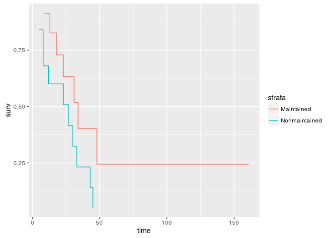
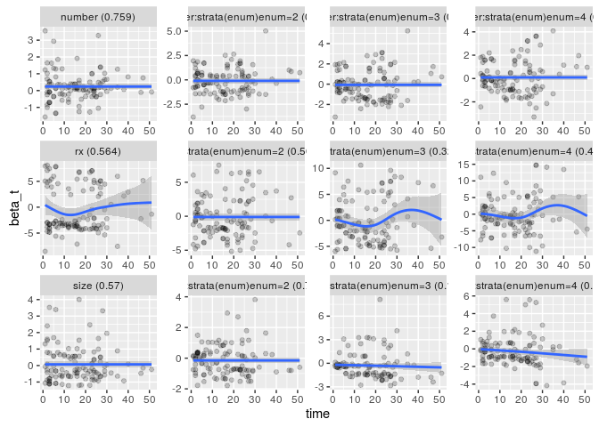
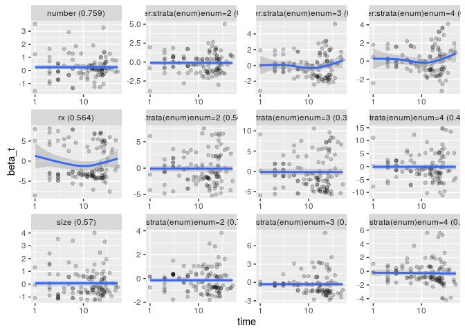

Event history analysis helper package
=====================================

Helper functions for event history analysis with the survival package.

Install
-------

Install from GitHub repository.

``` r
library(devtools)
install_github('junkka/ehahelper')
```

Functions
---------

#### ggsurv

Make a data.frame of a `survfit` or `coxph` object for visualization with ggplot2.

``` r
library(ehahelper)
library(survival)
library(ggplot2)
surv_object <- coxph(Surv(time, status) ~ strata(x), data = aml)
ggplot(ggsurv(surv_object), aes(time, surv, color=strata)) + geom_step()
```



#### gg\_zph

ggplot2 implementation for visualizing scaled Schoenfield residuals form a cox.zph object.

``` r
bladder1 <- bladder[bladder$enum < 5, ] 
fit <- coxph(Surv(stop, event) ~ (rx + size + number) * strata(enum) + 
          cluster(id), bladder1)
x <- cox.zph(fit, transform = "identity")
gg_zph(x)
```

    ## `geom_smooth()` using method = 'loess'



``` r
gg_zph(x, log = TRUE)
```

    ## `geom_smooth()` using method = 'loess'



#### coxme tidyer

Convert coxme objects to tidy format.

``` r
library(broom)
library(coxme)
fit <- coxme(Surv(y, uncens) ~ trt + (1|center), eortc)
knitr::kable(tidy(fit, exp = T), digits = 3)
```

| term |  estimate|  std.error|  statistic|  p.value|  conf.low|  conf.high|
|:-----|---------:|----------:|----------:|--------:|---------:|----------:|
| trt  |     2.031|      0.064|      11.03|        0|     1.791|      2.304|

``` r
fit_g <- glance(fit)
knitr::kable(as.data.frame(t(fit_g)), digits = 3)
```

|                          |          V1|
|--------------------------|-----------:|
| n                        |    2323.000|
| events                   |    1463.000|
| Chisq                    |     236.110|
| df                       |       2.000|
| logLik                   |  -10478.839|
| p                        |       0.000|
| AIC                      |   21015.051|
| BIC                      |   21166.750|
| random\_n\_center        |      37.000|
| random\_sd\_center       |       0.329|
| random\_variance\_center |       0.108|

#### coxme augment

Using a coxme model, add fitted values and standard errors to original dataset.

``` r
eortc_augmented <- augment(fit, eortc)

knitr::kable(head(eortc_augmented))
```

|     |          y|  uncens|  center|  trt|     .fitted|    .se.fit|
|-----|----------:|-------:|-------:|----:|-----------:|----------:|
| 2   |   506.1603|       1|       1|    1|   0.2037681|  0.0184739|
| 3   |   294.3800|       1|       1|    1|   0.2037681|  0.0184739|
| 4   |   383.9152|       1|       1|    0|  -0.5048446|  0.0457700|
| 5   |  2441.8338|       0|       1|    0|  -0.5048446|  0.0457700|
| 6   |  2442.2923|       0|       1|    0|  -0.5048446|  0.0457700|
| 7   |   312.3571|       1|       1|    1|   0.2037681|  0.0184739|

#### coxme predict

Get predicted vales based on a mixed-effects Cox model, fitted using the coxme package. Extends the standard predict.coxme function by allowing for new data, and by calculating relative risks, either overall or within stratum.

``` r
new_data <- data.frame(trt = unique(eortc$trt))

predict_coxme(fit, newdata = new_data, type = "risk")
```

    ## $fit
    ##         1         2 
    ## 1.2260138 0.6035994 
    ## 
    ## $se.fit
    ##          1          2 
    ## 0.02045537 0.03555950
