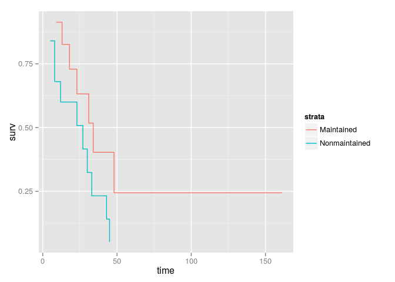
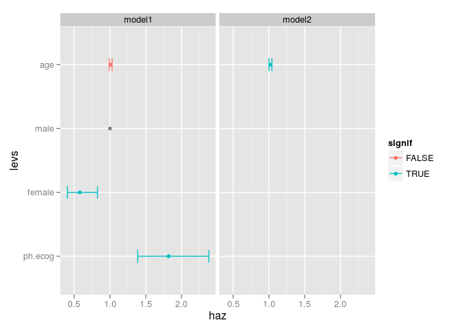

Event history analysis helper package
=====================================

Helper functions for event history analysis with the survival package.

Install
-------

Install from GitHub repository.

``` {.r}
library(devtools)
install_github('junkka/ehahelper')
```

Functions
---------

#### ggsurv

Make a data.frame of a `survfit` or `coxph` object for visualization with ggplot2.

``` {.r}
library(survival)
```

    ## Loading required package: splines

``` {.r}
library(ggplot2)
surv_object <- coxph(Surv(time, status) ~ strata(x), data = aml)
ggplot(ggsurv(surv_object), aes(time, surv, color=strata)) + geom_step()
```



#### split\_rows

Split rows at a split point if the split point falls between start and stop time.

``` {.r}
x <- split_rows(mgus1, 500, "id", "start","stop")
```

#### age\_split

Split event history data into sequences such as age groups. A row is split if the star and stop time stretches over a split point. Each row is assigned a new start and end time, a group and a duration within that group.

``` {.r}
mgus1$status <- ifelse(mgus1$event == "death", 1, 0)
x <- age_split(mgus1, "start", "stop", "id", "status", 500)
```

#### coxph\_to\_long

Create one long format table from multiple nested `coxph` objects.

``` {.r}
library(survival)
data('cancer', package = 'survival')
cancer$sex <- factor(cancer$sex, labels = c('male', 'female'))
model1 <- coxph(Surv(time, status) ~ age + sex  + ph.ecog + strata(inst), data = cancer)
model2 <- coxph(Surv(time, status) ~ age + strata(inst), data = cancer)
res <- coxph_to_long(model1, model2)
```

Visualize estimates by model

``` {.r}
ggplot(res, aes(haz, levs, color = signif)) + 
  geom_point() + 
  geom_errorbarh(aes(y = levs, xmin = ci_low, xmax = ci_high), height =0.2) + 
  facet_grid(.~model)
```



#### merge\_reg

Merge results from nested `coxph` regressions.

#### cox\_table

Create a simple results table from a `coxph` regression.
